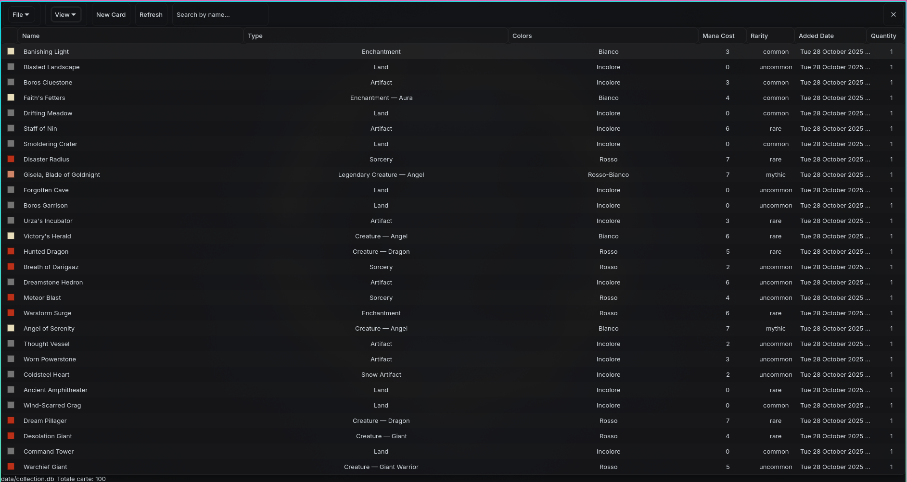

## 🎴 MagicDatabase

[](https://github.com/giacomotrinca/MagicDatabase/actions/workflows/ci.yml)
[](https://opensource.org/licenses/MIT)
[](https://gtk.org/)
[](https://isocpp.org/)

A compact GTK4 desktop app to manage your Magic: The Gathering collection. Built in C++17, it uses Scryfall for card data, stores collections in a local SQLite database, and supports features like foil tracking, bilingual UI, and flexible filtering.



## ✨ Highlights

- Scryfall integration for accurate card data and images
- Bilingual UI (Italian / English) with instant switching
- Foil-aware database (foil is a separate row; foil rows render in gold)
- Powerful filtering (colors, rarities, foil) and sorting
- Local SQLite storage with simple TXT export

## 🚀 Quickstart — Build & Run

Clone, build and run:

```fish
git clone https://github.com/giacomotrinca/MagicDatabase.git
cd MagicDatabase
make
./magicdb
```

If the binary starts, you're ready. If not, see the platform-specific steps below for installing dependencies.

## 🛠️ Dependencies (examples)

- C++17 toolchain (g++/clang)
- GTK4 development headers
- sqlite3 development headers
- libcurl development headers
- nlohmann/json (header-only; distro packages available)
- make

### Ubuntu / Debian

```fish
sudo apt update
sudo apt install -y build-essential pkg-config git \
  libgtk-4-dev libsqlite3-dev libcurl4-openssl-dev nlohmann-json3-dev
make
./magicdb
```

### Fedora

```fish
sudo dnf install -y @development-tools pkgconfig git \
  gtk4-devel sqlite-devel libcurl-devel nlohmann-json-devel
make
./magicdb
```

### Arch Linux

```fish
sudo pacman -Syu --needed base-devel git gtk4 sqlite curl nlohmann-json
make
./magicdb
```

### macOS (Homebrew)

```fish
brew update
brew install gtk4 sqlite curl nlohmann-json pkg-config
make
./magicdb
```

### Windows (MSYS2)

1. Install MSYS2: https://www.msys2.org/
2. Open "MSYS2 MinGW 64-bit" and run:

```fish
pacman -Syu
pacman -S --needed mingw-w64-x86_64-toolchain mingw-w64-x86_64-gtk4 \
  mingw-w64-x86_64-sqlite mingw-w64-x86_64-curl mingw-w64-x86_64-nlohmann-json git
cd /c/path/to/MagicDatabase
make
./magicdb.exe
```

##  How to Use (short)

1. Start the app (`./magicdb`).
2. File → New Database to create a collection (saved under `data/`).
3. Add cards using "New Card" and mark foil when needed.
4. Use View → Language to switch UI language; dates and labels update instantly.
5. Use the search box and View → Filters to refine the list.

Foil cards are stored as distinct rows and show with gold-colored text in the UI.

## 🧭 Developer Notes

- Card colors are stored as a JSON array in the `colors` column.
- The `foil` column is an integer (0/1) and is included in uniqueness checks so foil/non-foil are separate rows.
- UI filtering is currently client-side; for very large DBs we can convert filters to SQL queries.

## 🏗️ Architecture

- Frontend: GTK4 (C++)
- Backend: C++17 with SQLite
- Network: libcurl + nlohmann/json
- Localization: in-memory translation maps with dynamic UI updates

## 🧪 CI & Releases

The repository includes a GitHub Actions workflow that builds on Ubuntu and Windows, packages artifacts (tar.gz / zip), and uploads checksums. When you push a tag like `v1.2.3` the workflow will create a GitHub Release and attach the artifacts.

## 🤝 Contributing

Contributions are welcome!

1. Fork the repository
2. Create a branch: `git checkout -b feature/your-thing`
3. Implement and test
4. Push and open a Pull Request

Good first tasks: translations, unit tests for the database wrapper, SQL-filtering improvements.

## 📄 License

MIT — see the `LICENSE` file.

## 👋 Author / Contact

- Giacomo Trinca — https://github.com/giacomotrinca
- Issues: https://github.com/giacomotrinca/MagicDatabase/issues

---

May your draws be legendary. ✨

### Keyboard Shortcuts

- `Ctrl+N`: Add new card
- `Delete`: Delete selected card

### Acknowledgments

- [Scryfall](https://scryfall.com/)
- [GTK](https://gtk.org/)
- [nlohmann/json](https://github.com/nlohmann/json)

<parameter name="filePath">/mnt/01D9269698DA8D30/gitrepos/MagicDatabase/README.md