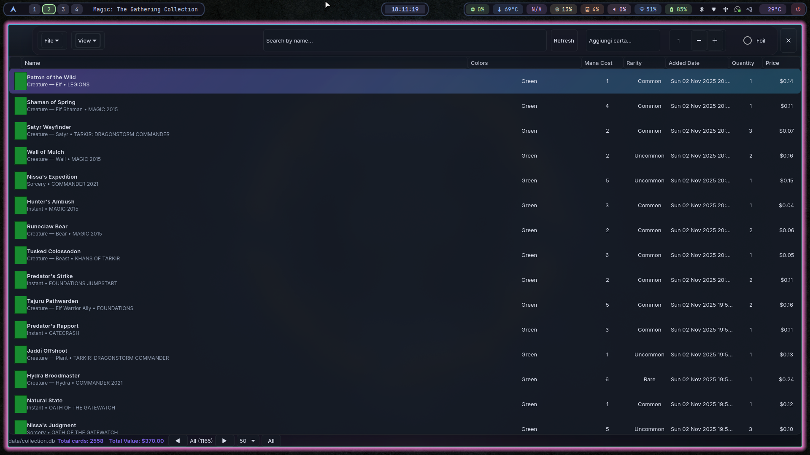
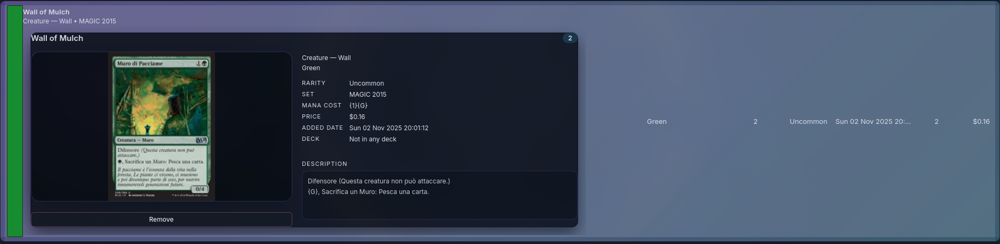
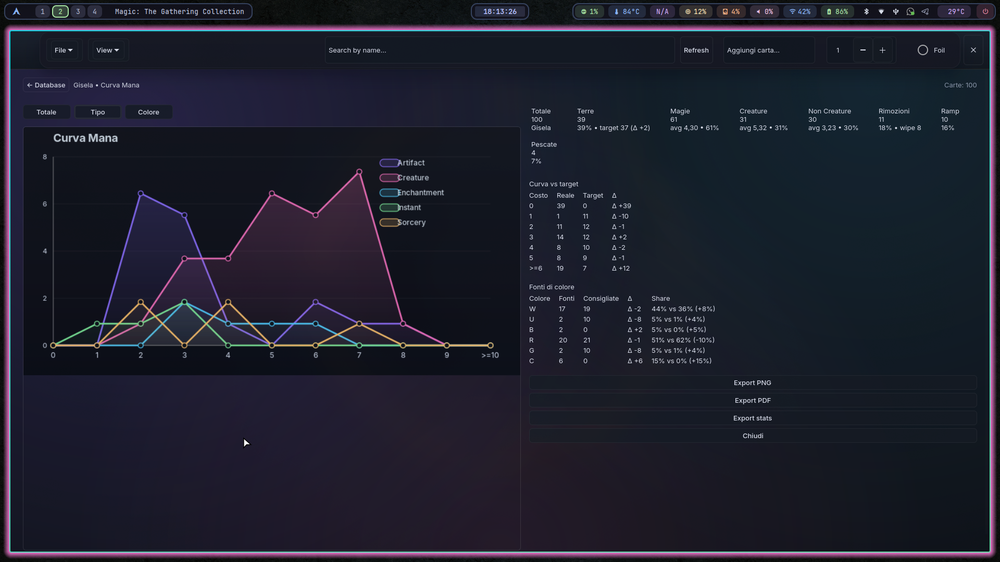

# MagicDatabase

**MagicDatabase** is your GTK4 command center for Magic: The Gathering. Sync straight from Scryfall, keep every card in a fast local SQLite vault, and break down mana curves without leaving the desktop.





## Table of Contents
- [Feature Rundown](#feature-rundown)
- [Mana Curve Engine](#mana-curve-engine)
- [Scryfall Sync and Pricing](#scryfall-sync-and-pricing)
- [Database and Storage](#database-and-storage)
- [Getting Started](#getting-started)
- [Everyday Workflow](#everyday-workflow)
- [Keyboard Shortcuts](#keyboard-shortcuts)
- [Data Layout](#data-layout)
- [Troubleshooting](#troubleshooting)
- [License](#license)

## Feature Rundown
- **Collection-first UI**: GTK4 `GtkColumnView` with instant sorting (including the USD price column), inline quantity updates, and paginated browsing. The footer keeps a running total of card count and aggregated value, formatted with currency helpers from `utils.cpp`.
- **Deck aware by design**: create, select, and purge decks, move cards between main and sideboard, and keep split quantities in sync when spreading a card across multiple lists.
- **Detail pane that matters**: double-click to open a sliding inspector with localized oracle text, pricing, color identity, and high-res art. Thumbnails are cached on disk (`data/img/`) via asynchronous prefetching so the list stays snappy even on cold starts.
- **Filters and search**: filter by color identity, rarity, foil status, deck membership, and string search (`Ctrl+F`). Filters mirror the bilingual UI, translating type/rary names on the fly.
- **Multilingual & polite**: toggle Italian/English from the View menu. Desktop notifications can be toggled directly from the View menu and the choice is persisted in `settings.ini`.
- **Exports built in**: from the File menu export the whole database or a single deck. Database exports are bilingual tables (EN/IT) with columns for mana cost, rarity, USD price, and foil flag; deck exports provide aligned main/sideboard lists in the chosen language.
- **Offline friendly**: once downloaded, cards, prices, settings, and images live locally. Scryfall responses are cached for 10 minutes, and the app never requires an always-on connection beyond the API calls you initiate.

## Mana Curve Engine
- **Scope aware**: the curve recomputes from whichever view you are in. On decks it uses the exact 99/60-card list; on the main database it respects current filters and aggregates duplicates exactly like the grid.
- **Bucket math**: converted mana values are summed into buckets `0..10` (with `>=6` collapsed into a single bar). Mana symbols are parsed from `{}` strings or legacy cost text, so hybrid and colorless pips contribute correctly.
- **Statistics galore**: averages and medians are tracked separately for the whole deck, non-land spells, creatures, and non-creature spells. The mode bucket, max bucket, and per-bucket card lists feed both the UI and the exported report.
- **Land targets**: recommended land counts follow a simple heuristic: 40% for 60-card shells, 38% for 70–89 cards, and 37% for 90+. The UI highlights the delta between the recommendation and your current land count.
- **Spell targets**: expected spell distributions shift automatically depending on deck size.

  | Mana Value | 60-card decks | Commander (90+) |
  | ---------- | ------------- | ---------------- |
  | 1          | 24%           | 18%              |
  | 2          | 22%           | 20%              |
  | 3          | 18%           | 19%              |
  | 4          | 16%           | 16%              |
  | 5          | 12%           | 14%              |
  | 6+         | 8%            | 13%              |

  Targets are converted into absolute counts for your spell total, and the report shows `actual / target / delta` for each bucket.
- **Color requirements**: land sources are inferred from JSON color data, type lines (`Plains`, `Island`, etc.), and oracle text that produces mana. The earliest turn you need one, two, or three of the same pip determines the requirement via these heuristics:

  | Earliest turn | Single pip | Double pip | Triple pip |
  | ------------- | ---------- | ---------- | ----------- |
  | 1             | 14 sources | -          | -           |
  | 2             | 12 sources | 20 sources | -           |
  | 3             | 11 sources | 17 sources | 23 sources  |
  | 4             | 10 sources | 15 sources | 21 sources  |
  | 5             | 9 sources  | 14 sources | 19 sources  |

  Shares between pips and actual colored sources are compared, and the UI labels deltas with up/down trend chips.
- **Role detection**: removal, board wipes, ramp, and card draw are detected through multilingual oracle-text heuristics (e.g., `destroy target`, `cerca nel tuo grimorio una carta terra`, `draw two cards`, `create a Treasure`). Counts surface in the sidebar and the exported text file.
- **Color and type overlays**: toggle between total curve, by-type (creature, instant, sorcery, enchantment, artifact, planeswalker, other) and by-color (WUBRGC) views. Lines use color-accurate palettes, dashed for white to keep contrast.
- **Exports**: one click produces `data/mana_curve_<name>.png`, `data/mana_curve_<name>.pdf` (vector via Cairo), and `data/mana_stats_<name>.txt` with bucket breakdowns, color shares, and per-bucket card lists. Surfaces are pre-rendered so swapping modes is instant.

## Scryfall Sync and Pricing
- Uses `libcurl` and `nlohmann::json` to hit Scryfall's search endpoint. Italian results are preferred; if none match the query, the app falls back to English and then backfills localized data when possible.
- Responses are cached (LRU-style) for 10 minutes per query, keeping repeated lookups instantaneous. Price lookups use the `cards/named?exact=` endpoint as a fallback when the search payload lacks USD data.
- Retrieved USD prices land in the database and in the dedicated price column. The main footer multiplies price by quantity to display total collection value; totals respect filters when you export.
- Artwork URLs are prefetched asynchronously into `data/img/` so once a card is seen the detail pane can load instantly even offline.

## Database and Storage
- Pure SQLite with automatic migrations: when opening a database, missing columns (`added_date`, `price_usd`, `english_name`, `localized_name`, `localized_type`, `deck_id`, `foil`, `sideboard`, `oracle_text`) are added in place. Auxiliary tables for potential features (snapshots, tags, notes) are provisioned automatically so extensions can hook straight into them.
- Full-text search (FTS5) tables and triggers are created when available, keeping the `cards_fts` index synchronized with inserts, updates, and deletes.
- Performance tweaks: WAL mode, relaxed synchronous, memory temp store, and helpful indexes (`deck_id`, `sideboard`, `set_code`, `added_date`, `foil`, `name`, `english_name`) are enabled automatically.
- Settings (language, notifications, focus retry parameters, last deck) are stored in `data/settings.ini`. The last opened database path is cached in `lastdb.txt` for quick relaunches.
- Fonts: the Inter family ships in `data/fonts/` so charts and the UI render consistently across distros.

## Getting Started
Clone, build, and run (fish shell example):

```fish
git clone https://github.com/giacomotrinca/MagicDatabase.git
cd MagicDatabase
make
./magicdb
```

### Dependencies
- C++17 toolchain (g++ or clang)
- GTK4 development headers
- SQLite3 development headers
- Cairo development headers (PNG/PDF export)
- libcurl development headers
- nlohmann-json (header-only) or distro package
- make and pkg-config

Ubuntu/Debian packages:

```fish
sudo apt update
sudo apt install -y build-essential pkg-config git \
  libgtk-4-dev libsqlite3-dev libcairo2-dev libcurl4-openssl-dev nlohmann-json3-dev
```

## Everyday Workflow
- Launch `./magicdb`, or rely on the auto-open of the last database via `lastdb.txt`.
- Create or open a database from **File → New/Open**. Everything lives under `data/`, so syncing the folder backs up cards, exports, and settings.
- Add cards with **File → New Card** (`Ctrl+N`). The dialog searches Scryfall, shows localized details, and inserts cards directly into the database. Foil state, oracle text, and USD price are stored along with the quantity.
- Build decks via **File → Create Deck**. Use drag/send actions to move cards between collection, main deck, and sideboard; the column view exposes quantity, price, rarity, and mana cost for quick auditing.
- Hit **View → Filters** to slice by color identity, rarity, foil state, or to show only cards not assigned to any deck. Filters are applied before mana-curve calculations and exports.
- Fire the **Mana Curve** action from the deck menu or toolbar for deep analytics. Use the type/color buttons above the chart to compare archetype silhouettes.
- Use **File → Export Database/Deck** when you need list text, or the mana-curve export buttons for presentation-ready assets.

## Keyboard Shortcuts
- `Ctrl+N` – add a card via Scryfall search
- `Ctrl+F` – focus the search box

## Data Layout
- `data/` – everything runtime-related: databases, exports, cached images, settings, mana-curve artifacts.
- `data/img/` – card art cached from Scryfall.
- `data/mana_curve_*.png|pdf|txt` – exports generated by the analytics view.
- `data/<deck>_data.txt` – deck exports; `data/tot_database_<date>_data.txt` and TSV/CSV siblings for collection exports.
- `lastdb.txt` – remembers the most recently opened database path.

## Troubleshooting
- **Missing GTK/Cairo headers**: ensure `pkg-config --cflags --libs gtk4` returns flags. Install `libgtk-4-dev` and `libcairo2-dev` if it does not.
- **Corrupted or empty PDF export**: verify Cairo development headers are available when compiling; rebuild after installing `libcairo2-dev`.
- **Duplicate rows**: foil and sideboard flags are part of the identity when aggregating. Toggle filters or merge duplicates from the deck management actions.
- **Scryfall quota or connectivity**: cached responses live for 10 minutes. If you query the same card repeatedly while offline, the cached entry will be used.

## Credits & Resources
- **Inter Typeface** — Designed by Rasmus Andersson. Download it from [rsms.me/inter](https://rsms.me/inter/) or Google Fonts and drop the regular weight into `data/fonts/Inter-Regular.ttf`; see `data/fonts/README.md` for the precise placement notes this project relies on.
- **Mana Symbol Font** — Crafted by Andrew Gioia and distributed under the SIL OFL 1.1. We ship the glyph set referenced in `img/mana/README.md`; the official homepage ([mana.andrewgioia.com](https://mana.andrewgioia.com)) lists usage guidance and extension tips.
- **GTK Inspector & Friends** — The warning clean-up journey used `GTK_DEBUG=interactive` extensively. Keep that flag handy when you are iterating on theming.
- **Scryfall API** — Thanks to the Scryfall team for providing the public API that powers search, prices, and card imagery.

## License

MIT — see `LICENSE` for full terms. Built by [Giacomo Trinca](https://github.com/giacomotrinca); issues and feature requests welcome.

## Changelog
- **2025-11-05** — Registered the bundled Mana icon font via Fontconfig, eliminated GTK theme parser warnings, refreshed theming credits, and introduced this changelog to track high-impact tweaks.
